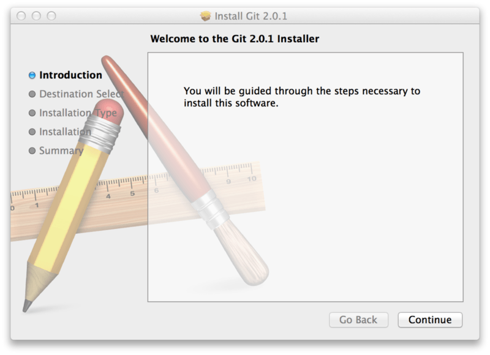

1. Instalação do GIT

É possível instalar o git por download no site do git  http://git-scm.com/downloads, ou pelo terminal, como é feito no linux pro exemplo.
Importante citar que no site oficial do git, é recomendado que mesmo que já tenha instalado o git, realizar a atualização mais recente.

* 1.1 Instalação Windows

ir á página de download e baixar a versão de windows por esse link http://git-scm.com/download/win, este é um projeto git exclusivo para windows também nomeado de "msysGit", caso tenha interesse em entender mais sobre esse projeto, visite: http://msysgit.github.io/.

* 1.2 Instalação para Linux

Você pode instalar git normalmaneto na página de downloads mas também por meio de um isntalador binário, caso seja esse seu caso, aqui vão as instruções necessárias para tal, geralmente você pode instalar pela ferramenta básica de gerenciamento de pacotes que vem com o linux e caso utilize fedora, utilize o yum com este comando: '$ sudo yum install git-all'.
Agora caso utilize uma distribuição em debian como o ubuntu, use o apt-get com o comando: '$ sudo apt-get install git-all'.
Para mais informações de instalação git em outros sistemas unix vá em: http://git-scm.com/download/linux.

* 1.3 Instalação para Mac

No mac há diversas maneiras de instalar o git, o modo mais comum seria instalar por meio das ferramentas de linha de comando Xcode.
Em máquinas OS mavericks 10.9 você pode instalar simplesmente rodando git, no terminal pela primeira vez.
Caso queira uam versão mais atualizada, é possível instalar por meio de instalador binário, o isntalador OSX Git é mantido e disponível para download no site do git de Mac OS http://git-scm.com/download/mac.
 imagem do OSX git
Também é possível instalar via download do github para Mac, seu GUI git tem opções de instalação de ferramentas de linah de comando, para mais informações visite http://mac.github.com.

2. Comandos de Configuração 
git config

* 2.1 $ git config --global user.name "Seu Nome de Usuário GitHub"

configuração de usuário, adição de nome do github, configuração global, que faz com que o git salve essa configuração para todo comando que realizar no futuro. configuração também pode ser desfeita utilizando 'git config --global --unset user.name'.

* 2.2 $ git config --global user.email "emailgithub@exemplo.com"

configuração de usuário, adiçaõ de email linkado ao nome de usuário, configuração global, fazendo com que o git salve essas informações para futuros comandos. configuração também pode ser desfeita utilizando 'git config --global --unset user.email'.

* 2.3 $ git config --list

configuração de checagem de informações, aqui você pdoerá ver se seu usuário e email coincidem aos do github, e se foram digitados corretamente, como citado acima, caso haja algum erro não incondizente com o desejado, utilizar os comandos de '--unset' de nome e email.

3. Checagem da Instalação

Há possibilidade de verificar se o git foi instalado em sua máquia utilizando um comando simples em qualquer terminal 'git --version' assim será apresentado a versão atual do programa, verificando se o programa está instalado.