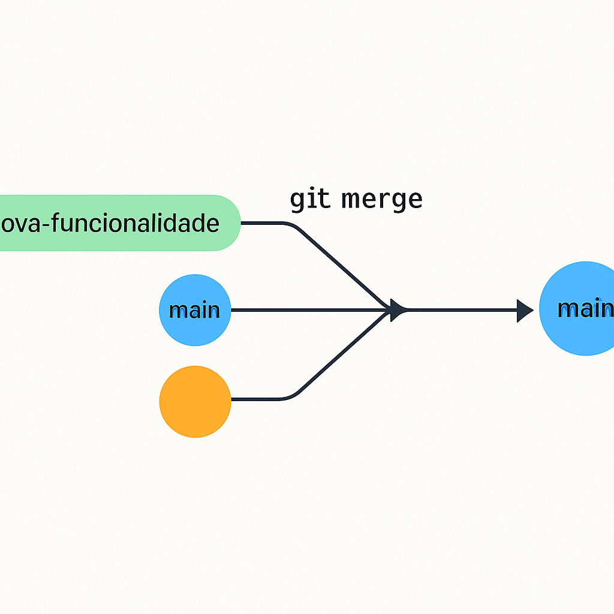
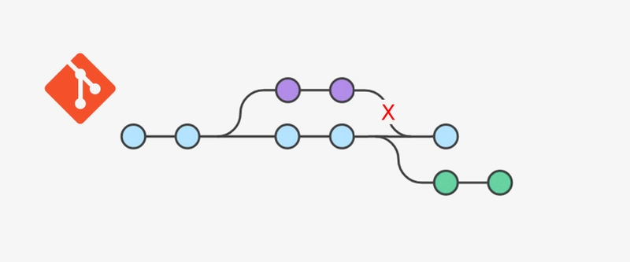

## **O QUE SÃO BRANCHES (RAMIFICAÇÕES)🌱 ?**
- *Branch* significa "ramo" ou "ramificação";
- São linhas do tempo alternativas no projeto, permitindo que você desenvolva novas 
funcionalidades sem afetar a linha principal;
- A *branch main* (ou master, antigamente) é a linha do tempo principal do projeto.

    `🔎 Resumo:` *Branches* são "linhas do tempo" diferentes do projeto. 
    A principal geralmente se chama `main`. Você pode criar novas branches 
    para testar ou desenvolver algo sem afetar a principal

*🧪 Exemplo prático: criação de uma branch*
    Dentro de um repositório Git já iniciado, use o comando:

_______________`git branch nova-branch`_____________________

    - Esse comando cria uma nova ramificação chamada nova-branch,     
      baseada no - estado atual da branch ativa (geralmente main).

 **🖼️ Representação Visual**
    A imagem abaixo mostra um exemplo de como as branches funcionam:

    - 🔵 A linha azul representa a branch principal (main).

    - 🟢🟠 As outras cores representam novas branches criadas para funcionalidades
     ou testes.

    - 🔁 Mais tarde, essas branches podem ser mescladas (merge) de volta à principal.

---

## **🔧 CRIAR, MUDAR E DELETAR BRANCHES**
    Branches (ou ramificações) permitem que você trabalhe em diferentes versões do seu 
    projeto sem afetar diretamente o código principal (geralmente o branch `main`). Isso 
    é útil para desenvolver novas funcionalidades, corrigir bugs ou testar algo novo.

### Criar uma nova branch:
    Para criar um novo branch e já mudar para a mesma, use o comando:

________`git checkout -b nome-do-branch`_____________

**Ou, em duas etapas:**
_______`git branch nome-do-branch` # Cria o branch
_______`git checkout nome-do-branch` # Troca para a branch selecionada no comando

*Exemplo:*
_______`git checkout -b feature/pagina-contato`_____________
- Isso cria um branch chamado feature/pagina-contato e te coloca nele.

### 🔄 MUDAR DE BRANCH
    Para trocar para outro branch existente, use:
________`git checkout nome-do-branch`__________

*Exemplo:*
_________`git checkout main`_____________
- Você volta para o branch principal.

### 🗑️ DELETAR UM BRANCH:
    Depois de finalizar e mesclar seu branch, é uma boa prática deletá-lo p
    ara manter o repositório limpo.

**Para deletar localmente:**
_________`git branch -d nome-do-branch`____________

*Exemplo:*
_______`git branch -d feature/pagina-contato`_________
 - Use -D (maiúsculo) se quiser forçar a exclusão, mesmo que o branch não 
 tenha sido  mesclado.

**Para deletar do repositório remoto:**
_______`git push origin --delete nome-do-branch`__________

*Exemplo:*
________`git push origin --delete feature/pagina-contato`___________

**📋 Dica Usual**
    Use o comando abaixo para ver os branches existentes e qual está ativo:
_______________________`git branch`__________________________

---

## **🔀 GIT MERGE E CONFLITOS: Unindo Códigos com Segurança**

- 📌 O que é `git merge`?
    O comando git merge serve para unir o histórico de um 
    branch (ramificação) com outro. É muito utilizado para 
    juntar as alterações feitas em uma branch de funcionalidade 
    (feature, por exemplo) com a branch principal (main).

*Exemplo prático:*
_______`git checkout main`______________
_______`git merge feature/pagina-contato`________
- Esse comando une o conteúdo da branch feature/pagina-contato na main. 

**🖼️ Representação Visual da junção das branches/ das mudanças**

*Figura:* Exemplo visual de como o Git une mudanças de diferentes 
branches.

# **- ⚠️ O que são conflitos?**
    Conflitos acontecem quando o Git não consegue decidir automaticamente 
    qual parte do código deve permanecer. Isso geralmente ocorre quando duas 
    branches alteram a mesma linha de um arquivo ou um arquivo foi deletado em
     um branch e editado em outro.

**🖼️ Representação Visual dos conflitos**

*Legenda:*  Este diagrama mostra como o Git identifica conflitos quando 
diferentes alterações são feitas simultaneamente em branches diferentes.

**💥 Quando surgem os conflitos?**
    Conflitos aparecem quando o Git não consegue decidir automaticamente como 
    juntar mudanças feitas nas mesmas linhas de um arquivo ou quando arquivos f
    oram modificados de forma incompatível em branches diferentes.

*🛠 Como resolver conflitos?*

- 1. Faça o merge:
__________`git merge feature-x`__________________

- 2. Git avisa dos conflitos:
    Você verá algo como :

    Auto-merging arquivo.txt
    CONFLICT (content): Merge conflict in arquivo.txt
    Automatic merge failed; fix conflicts and then commit 
    the result.

- 3. Abra os arquivos em conflito
    O Git marca os conflitos assim:

        <<<<<<< HEAD
    Este é o conteúdo da sua branch atual (ex: main)
    =======
    Este é o conteúdo da branch que você está mesclando (ex: feature-x)
    >>>>>>> feature-x

    - Você deve escolher uma versão, mesclar as duas ou reescrever 
    como quiser. Depois, remova os marcadores (<<<<<<<, =======, >>>>>>>).

- 4. Marque como resolvido
    Após editar os arquivos e salvar:
___________`git add arquivo.txt`________________

- 5. Finalize o merge
________________`git commit`_____________________
- (O Git pode abrir o editor para que você confirme a mensagem 
de merge, ou já faz isso automaticamente.)

**🧼 Dica para ver o que está em conflito**
_______________`git status`_______________________
- Ele mostra todos os arquivos que ainda têm conflitos.

